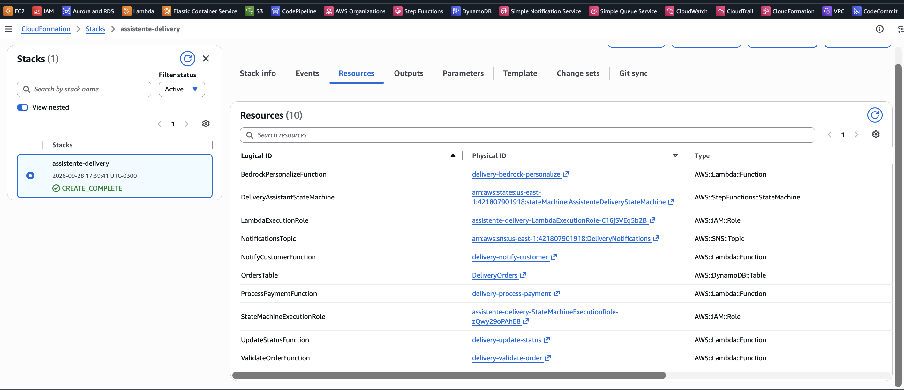
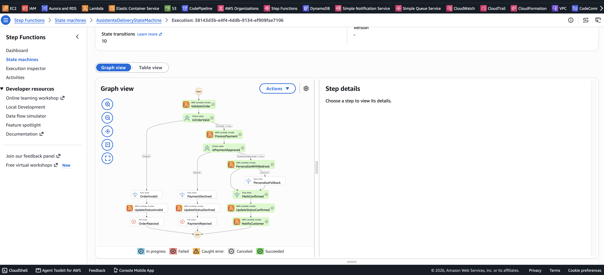
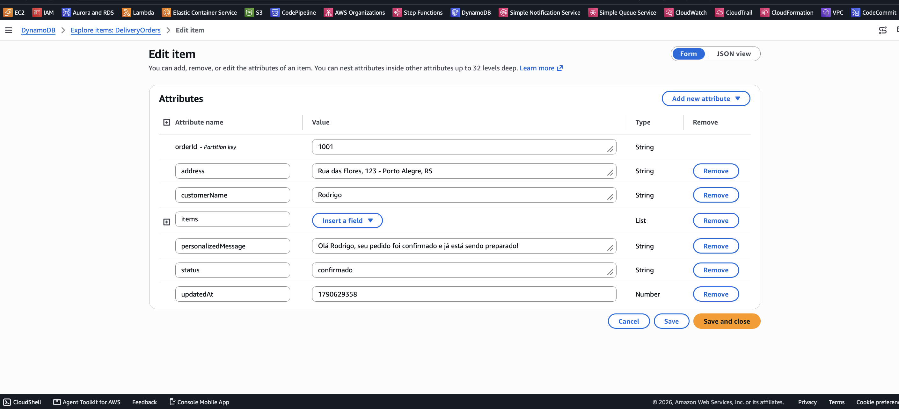
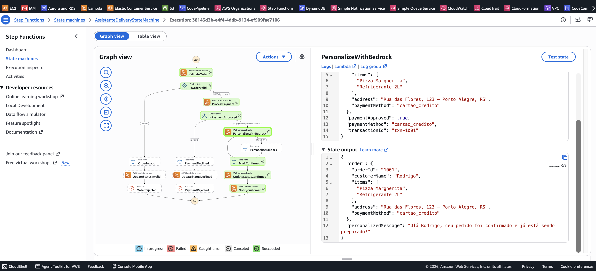
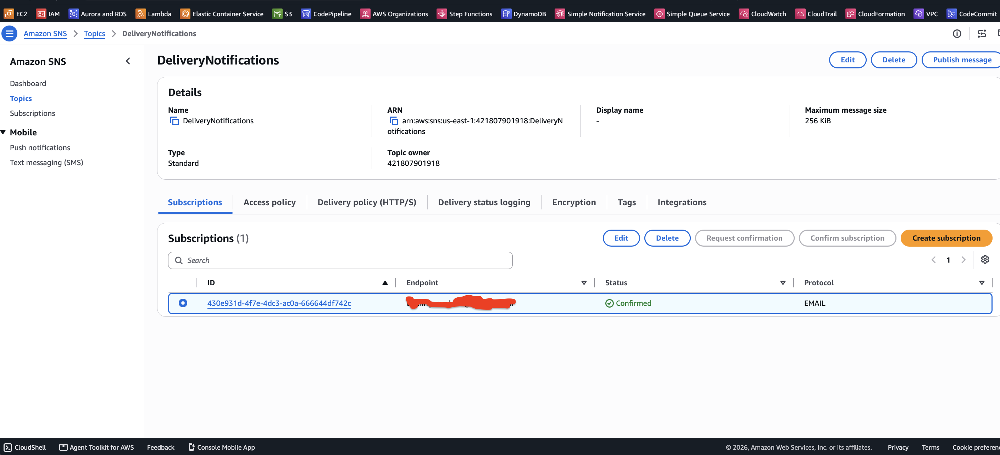

# Assistente de Delivery com AWS Step Functions e Amazon Bedrock

Desafio prático (DIO) para orquestrar o fluxo completo de um pedido de delivery — da recepção à notificação final — usando **AWS Step Functions** para a coordenação das etapas e **Amazon Bedrock** para gerar uma mensagem de confirmação personalizada para o cliente.

## 🏗️ Arquitetura

```
                                ┌───────────────────┐
   Pedido (JSON) ──────────────▶│   Step Functions   │
                                │  State Machine      │
                                └─────────┬──────────┘
                                          │
                 ┌────────────────────────┼────────────────────────┐
                 ▼                        ▼                        ▼
         ValidateOrder            ProcessPayment           PersonalizeWithBedrock
         (Lambda)                 (Lambda, simulado)        (Lambda + Amazon Bedrock)
                 │                        │                        │
                 └───────────┬────────────┴────────────┬───────────┘
                              ▼                         ▼
                      UpdateStatus (Lambda)     NotifyCustomer (Lambda)
                              │                         │
                              ▼                         ▼
                     DynamoDB (DeliveryOrders)    SNS (DeliveryNotifications)
```


*(print da execução no console do Step Functions — adicionar após o deploy)*

## 🔁 Fluxo do Step Functions

1. **ValidateOrder** — valida os campos obrigatórios do pedido (`orderId`, `customerName`, `items`, `address`, `paymentMethod`).
   - Inválido → grava status `pedido_invalido` no DynamoDB e encerra com `Fail`.
2. **ProcessPayment** — simula a integração com um serviço de pagamento.
   - Recusado → grava status `pagamento_recusado` no DynamoDB e encerra com `Fail`.
3. **PersonalizeWithBedrock** — chama o Amazon Bedrock via **Converse API** (modelo configurável via parâmetro `BedrockModelId`, padrão `anthropic.claude-haiku-4-5-20251001-v1:0`) para gerar uma mensagem de confirmação personalizada com base no nome do cliente e nos itens do pedido.
   - Em caso de erro no Bedrock, um `Catch` direciona para uma mensagem padrão (`PersonalizeFallback`), garantindo que o pedido não trave.
4. **UpdateStatus** — grava o pedido confirmado (status `confirmado`) na tabela DynamoDB `DeliveryOrders`, junto com a mensagem gerada.
5. **NotifyCustomer** — publica a mensagem personalizada no tópico SNS `DeliveryNotifications`.

## 📦 Recursos provisionados (`template.yaml`)

| Recurso | Tipo | Função |
|---|---|---|
| `DeliveryAssistantStateMachine` | AWS::StepFunctions::StateMachine | Orquestra o fluxo do pedido |
| `ValidateOrderFunction` | AWS::Lambda::Function | Valida o pedido |
| `ProcessPaymentFunction` | AWS::Lambda::Function | Simula o pagamento |
| `BedrockPersonalizeFunction` | AWS::Lambda::Function | Gera a mensagem via Amazon Bedrock |
| `UpdateStatusFunction` | AWS::Lambda::Function | Atualiza o status do pedido |
| `NotifyCustomerFunction` | AWS::Lambda::Function | Notifica o cliente via SNS |
| `OrdersTable` | AWS::DynamoDB::Table | Armazena os pedidos e status |
| `NotificationsTopic` | AWS::SNS::Topic | Canal de notificação ao cliente |
| `LambdaExecutionRole` / `StateMachineExecutionRole` | AWS::IAM::Role | Permissões mínimas necessárias |

Os códigos das Lambdas também estão disponíveis separadamente, comentados, em [`/lambdas`](./lambdas) — o `template.yaml` usa o mesmo conteúdo embutido (`ZipFile`) para permitir deploy direto, sem necessidade de bucket S3 para o pacote de código.

## 🚀 Deploy

### Pré-requisito: habilitar o modelo no Amazon Bedrock

Antes do deploy, acesse **Amazon Bedrock → Model catalog** no console (na região onde vai fazer o deploy, ex: `us-east-1`) e solicite acesso ao modelo `Claude Haiku 4.5` (ou outro de sua escolha, ajustando o parâmetro `BedrockModelId` — desde que o modelo suporte a Converse API). Para modelos Anthropic, é necessário preencher o formulário "Submit use case details" na primeira vez.

### Opção 1 — Console AWS

1. Acesse **CloudFormation → Create stack → With new resources**.
2. Faça upload do `template.yaml`.
3. Marque a opção de criação de recursos IAM (`I acknowledge that AWS CloudFormation might create IAM resources`).
4. Finalize a criação e aguarde o status `CREATE_COMPLETE`.

### Opção 2 — AWS CLI

```bash
aws cloudformation deploy \
  --template-file template.yaml \
  --stack-name assistente-delivery \
  --capabilities CAPABILITY_IAM \
  --parameter-overrides BedrockModelId=anthropic.claude-haiku-4-5-20251001-v1:0
```

## 🧪 Como testar

1. No console do **Step Functions**, abra `AssistenteDeliveryStateMachine`.
2. Clique em **Start execution** e cole o conteúdo de um dos arquivos em [`/test-events`](./test-events):
   - `pedido-valido.json` — fluxo feliz, termina com notificação enviada.
   - `pedido-pagamento-recusado.json` — encerra em `PaymentRejected`.
   - `pedido-invalido.json` — encerra em `OrderRejected`.
3. Acompanhe a execução no diagrama visual e confira o `output` de cada estado.
4. Verifique o item gravado na tabela **DynamoDB → DeliveryOrders**.
5. Confirme o e-mail/SMS recebido, se houver uma assinatura configurada no tópico SNS **DeliveryNotifications** (inscreva um e-mail em **SNS → Subscriptions** antes do teste).

## 📸 Evidências

| Etapa | Print |
|---|---|
| Stack criado no CloudFormation |  |
| Execução com sucesso no Step Functions |  |
| Item gravado no DynamoDB |  |
| Mensagem personalizada gerada pelo Bedrock |  |
| Notificação recebida (SNS) |  |

## 🛠️ Tecnologias utilizadas

- AWS Step Functions
- AWS Lambda (Python 3.12)
- Amazon Bedrock
- Amazon DynamoDB
- Amazon SNS
- AWS CloudFormation

## 📚 Sobre o desafio

Desafio da [DIO](https://www.dio.me/) para orquestrar um fluxo de pedidos de delivery, desde a recepção até a entrega final, combinando **AWS Step Functions** (orquestração) e **Amazon Bedrock** (personalização via IA generativa).
